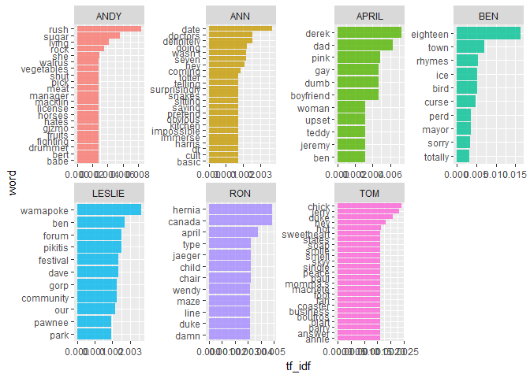
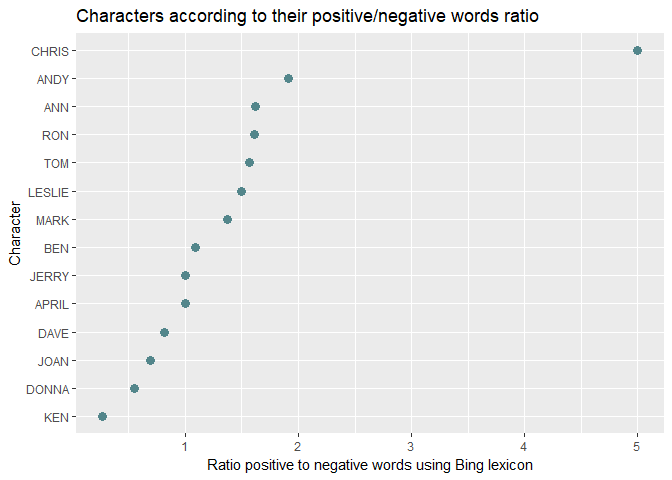
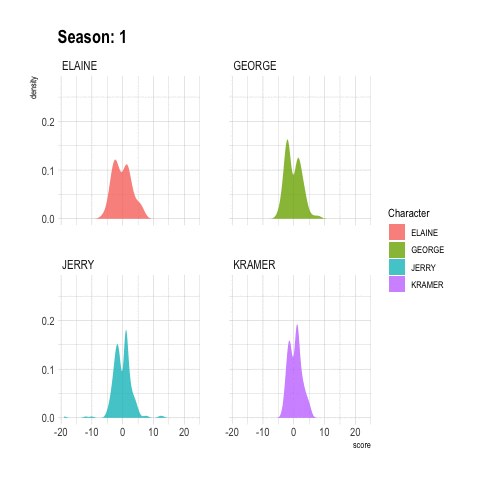
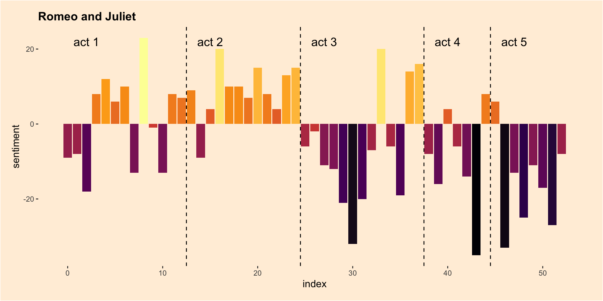
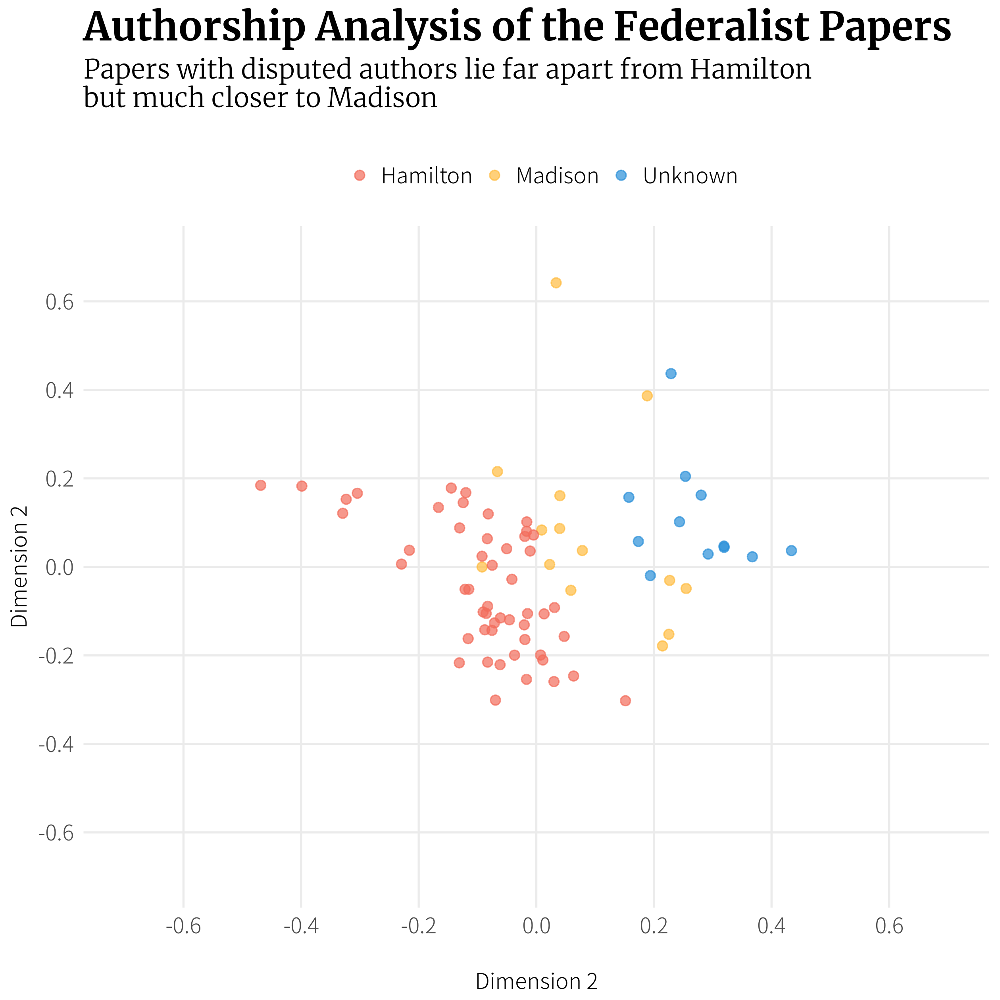

```{r init, include=F}
library(knitr)
opts_chunk$set(message=FALSE, warning=FALSE, eval=TRUE, echo=TRUE, cache=TRUE)
options(digits=3)
options(max.print=200)
.ex <- 1 # Track ex numbers w/ hidden var. Increment each ex: `r .ex``r .ex=.ex+1`

library(ggplot2)
theme_set(theme_minimal(base_size=12) + theme(strip.background = element_blank()))
```

## Class overview

<small>

> **_Attribution_:** This workshop was inspired by and/or modified in part from [_Text Mining with R_](https://www.tidytextmining.com/) by Julia Silge and David Robinson.

</small>

Most of the data we've dealt with so far in this course has been rectangular, in the form of a data frame or tibble, and mostly numeric. But lots of data these days comes in the form of unstructured text. This workshop provides an overview of fundamental principles in text mining, and introduces the **[tidytext](https://cran.r-project.org/web/packages/tidytext/index.html)** package that allows you to apply to text data the same "tidy" methods you're familiar with for wrangling and vizualizing data.

Course pre-requisites:

- [R Basics](r-basics.html) 
- [Data frames](r-dataframes.html)
- [Manipulating and analyzing data with **dplyr**](r-dplyr-yeast.html) (and the associated [homework](r-dplyr-homework.html))
- [Tidying data with **tidyr**](r-tidy.html)
- [Data visualization with **ggplot2**](r-viz-gapminder.html) (and the associated [homework](r-viz-homework.html))

This course is _not_ an extensive deep dive into natural language processing (NLP). For that check out the [CRAN task view on NLP](https://cran.r-project.org/web/views/NaturalLanguageProcessing.html) for a long list of packages that will aid you in computational linguistics.

Before we get started, let's load the packages we'll need.

```{r}
library(tidyverse)
library(tidytext)
library(gutenbergr)
library(topicmodels)
```


## The Tidy Text Format

In the previous lessons linked above we discussed the three features of Tidy Data, as outlined in Hadley Wickham's [Tidy Data paper](http://vita.had.co.nz/papers/tidy-data.html):

- Each variable is a column
- Each observation is a row
- Each type of observational unit is a table

Tidy text format can be defined as **a table with one-token-per-row.** A **token** is any meaningful unit of text, such as a word, that we are interested in using for analysis. **Tokenization** is the process of splitting text into tokens. This is in contrast to storing text in strings or in a document-term matrix (discussed later). Here, the token stored in a single row is most often a single word. The **[tidytext](https://cran.r-project.org/web/packages/tidytext/index.html)** package provides functionality to tokenize strings by words (or n-grams, or sentences) and convert to a one-term-per-row format. By keeping text in "tidy" tables, you can use the normal tools you're familiar with, including dplyr, tidyr, ggplot2, etc., for manipulation, analysis, and visualization. The tidytext package also includes functions to convert to and from other data structures for text processing, such as a _corpus_[^corpus] or a _document-term matrix_.[^dtm]

[^corpus]: Corpus objects contain strings annotated with additional metadata.
[^dtm]: This is a (sparse) matrix describing a collection (corpus) of documents with one row for each document and one column for each term. The value in the matrix is typically word count or tf-idf for the document in that row for the term in that column.


### The `unnest_tokens` function

We briefly mentioned before how to create vectors using the `c()` function. Let's create a simple character vector.

```{r}
text <- c("a", "banana", "crouton")
```

Let's extend that to create another character vector, this time with sentences:

```{r, results='hide'}
text <- c("It was the best of times,",
          "it was the worse of times,",
          "It was the spring of hope, it was the winter of despair.")
text
```

Before we can turn this into a tidy text dataset, we first have to put it in a data frame.

```{r}
text_df <- tibble(line = 1:3, text = text)
text_df
```

This data isn't yet "tidy." We can't do the kinds of operations like filter out particular words or summarize operations, for instance, to count which occur most frequently, since each row is made up of multiple combined words. We need to convert this so that it has **one-token-per-document-per-row**. Here we only have a single document, but later we'll have multiple documents.

We need to (1) break the text into individual tokens (i.e. *tokenization*) and transform it to a tidy data structure. To do this, we use tidytext's `unnest_tokens()` function.

```{r}
text_df %>%
  unnest_tokens(output=word, input=text)
```

The `unnest_tokens` function takes a data frame (or tibble), and two additional parameters, the `output` and `input` column names. If you specify them in the correct order, you don't have to specify `output=` or `input=`. You can pipe to `print(n=Inf)` to print them all.

```{r, results='hide'}
text_df %>%
  unnest_tokens(word, text) %>% 
  print(n=Inf)
```

First you give it the output column name that will be created as the text is unnested into it (`word`, in this example). This is a column name that you choose -- you could call it anything, but `word` usually makes sense. Then you give it the input column that the text comes from in the data frame you're passing to it (`text`, in this case). Our `text_df` dataset has a column called `text` that contains the data of interest.

The `unnest_tokens` function splits each row so that there is one word per row of the new data frame; the default tokenization in `unnest_tokens()` is for single words, as shown here. Also notice:

- Other columns, such as the line number each word came from, are retained.
- Punctuation has been stripped.
- By default, `unnest_tokens()` converts the tokens to lowercase, which makes them easier to compare or combine with other datasets. (Use the `to_lower = FALSE` argument to turn off this behavior).

Now our data is in a tidy format, and we can easily use all the normal dplyr, tidyr, and ggplot2 tools.

### Example: Jane Austen Novels

```{r, echo=FALSE, include=FALSE}
janeaustenr::austen_books() %>% 
  group_by(book) %>%
  mutate(linenumber = row_number(),
         chapter = cumsum(str_detect(text, regex("^chapter [\\divxlc]",
                                                 ignore_case = TRUE)))) %>%
  ungroup() %>% 
  filter(text!="") %>% 
  write_csv("data/austen.csv")
```

Let's load the **[austen.csv](data/austen.csv)** data. 

```{r, results='hide'}
jaorig <- read_csv("data/austen.csv")
jaorig
```

Click the `jaorig` dataset in the environment pane or use `View(jaorig)` to see what's being read in here. Before we can do anything else we'll need to tidy this up by unnesting the `text` column into words.

```{r, results='hide'}
jatidy <- jaorig %>% 
  unnest_tokens(word, text)
jatidy
```

Let's use the dplyr `count` function to count how many occurances we have for each word in the entire corpus. The `sort=TRUE` option puts the most common results on top.

```{r, results='hide'}
jatidy %>%
  count(word, sort = TRUE) 
```

Not surprisingly the most common words are some of the most commonly used words in the English language. These are known as [stop words](https://en.wikipedia.org/wiki/Stop_words). They're words you'll want to filter out before doing any text mining. There are lists of stop words online, but the tidytext package comes with a `stop_words` built-in dataset with some of the most common stop words across three different lexicons. See `?stop_words` for more information.

```{r, results='hide'}
data(stop_words)
stop_words
```

As in a previous lesson where we did an `inner_join` to link information across two different tables by a common key, there's also an [`anti_join()`](https://dplyr.tidyverse.org/reference/join.html#join-types) which takes two tibbles, _x_ and _y_, and returns all rows from _x_ where there are not matching values in _y_, keeping just columns from _x_. Let's `anti_join` the data to the stop words. Because we chose "word" as the output variable to `unnest_tokens()`, and "word" is the variable in the `stop_words` dataset, we don't have to be specific about which columns we're joining.

```{r, results='hide'}
jatidy %>% 
  anti_join(stop_words)
```

Now there are _far_ fewer rows than initially present. Let's run that count again, now with the stop words removed.

```{r}
jatidy %>%
  anti_join(stop_words) %>% 
  count(word, sort = TRUE) 
```

That's _much_ more in line with what we want. We have this data in a tibble. Let's keep piping to other operations!

```{r}
jatidy %>%
  anti_join(stop_words) %>% 
  count(word, sort = TRUE) %>% 
  head(20) %>% 
  mutate(word = reorder(word, n)) %>%
  ggplot(aes(word, n)) +
  geom_col() +
  coord_flip()
```

## Sentiment Analysis

Let's start to do some high-level analysis of the text we have. Sentiment analysis^[<https://en.wikipedia.org/wiki/Sentiment_analysis>], also called opinion mining, is the use of text mining to "systematically identify, extract, quantify, and study affective states and subjective information." It's a way to try to understand the emotional intent of words to infer whether a section of text is positive or negative, or perhaps characterized by some other more nuanced emotion like surprise or disgust.

If you make a simplifying assumption regarding the text you have as a combination of its individual words, you can treat the sentiment content of the whole text as the sum of the sentiment content of the individual words. It's a simplification, and it isn't the only way to approach sentiment analysis, but it's simple and easy to do with tidy principles.

To get started you'll need a _sentiment lexicon_ that attempt to evaluate the opinion or emotion in text. The tidytext package contains several sentiment lexicons in the `sentiments` dataset. All three of these lexicons are based on single words in the English language, assigning scores for positive/negative sentiment, or assigning emotions like joy, anger, sadness, etc. 

- **`nrc`** from Saif Mohammad and Peter Turney^[<http://saifmohammad.com/WebPages/NRC-Emotion-Lexicon.htm>] categorizes words in a binary fashion ("yes"/"no") into categories of positive, negative, anger, anticipation, disgust, fear, joy, sadness, surprise, and trust. 
- **`bing`** from Bing Liu and collaborators^[<https://www.cs.uic.edu/~liub/FBS/sentiment-analysis.html>] categorizes words in a binary fashion into positive and negative categories.
- **`AFINN`** from Finn Arup Nielsen^[<http://www2.imm.dtu.dk/pubdb/views/publication_details.php?id=6010>] assigns words with a score that runs between -5 and 5, with negative scores indicating negative sentiment and positive scores indicating positive sentiment.

The built-in `sentiments` dataset available when you load the tidytext package contains all of this information. You could filter it to a single lexicon with the dplyr `filter()` function, or use tidytext's `get_sentiments()` to get specific sentiment lexicons containing only the data used for that lexicon.

```{r fixme1, results="hide", eval=FALSE}
# Look at the sentiments data
data(sentiments)
sentiments
sentiments %>% filter(lexicon=="nrc")
sentiments %>% filter(lexicon=="bing")
sentiments %>% filter(lexicon=="AFINN")

# Use the built-in get_sentiments() function
get_sentiments("nrc")
get_sentiments("bing")
get_sentiments("afinn")
```

There are a few major caveats to be aware of. 

1. The sentiment lexicons we're using here were constructed either via crowdsourcing or by the work of the authors, and validated using crowdsourcing, movie/restaurant reviews, or Twitter data. It's unknown how useful it is to apply these lexicons to text from a completely different time and place (e.g., 200-year old fiction novels). Further, there are other domain-specific lexicons available, e.g., for finance data, that are better used in that context.
1. May words in the English language are fairly neutral, and aren't included in any sentiment lexicon. 
1. Methods based on unigrams (single words) do not take into account qualifiers before a word, such as in "no good" or "not true". If you have sustained sections of sarcasm or negated text, this could be problematic.
1. The size of the chunk of text that we use to add up single-word sentiment scores matters. Sentiment across many paragraphs often has positive and negative sentiment averaging out to about zero, but sentence-sized or paragraph-sized text might be better.


### Sentiment analysis with tidy tools

Let's look at the most common joy words in _Emma_. To do this we will:

1. Start with the unnested Jane Austen text data.
1. Join it to the NRC sentiment lexicon.
1. Filter it to only include "joy" words.
1. Filter for only words in _Emma_.
1. Count the number of occurences of each word, sorting the output with the highest on top.

```{r}
jatidy %>% 
  inner_join(get_sentiments("nrc")) %>% 
  filter(sentiment=="joy") %>% 
  filter(book=="Emma") %>% 
  count(word, sort=TRUE)
```

Try running the same code but replacing "joy" with "anger" or "trust."

```{r, results='hide'}
jatidy %>% 
  inner_join(get_sentiments("nrc")) %>% 
  filter(sentiment=="anger") %>% 
  filter(book=="Emma") %>% 
  count(word, sort=TRUE)
```

Let's look at how sentiment changes over time throughout each novel. 

1. Start with the unnested Jane Austen text data.
1. Join it to the 'bing' sentiment lexicon (positive vs negative).
1. Create a new variable that counts up each 80-line section. First note that the `%/%` operator does integer division. It tells you the integer quotient without the remainder. This is a way for us to keep track of which 80-line section of text we are counting up negative and positive sentiment in. 
1. Count the number of occurances of each sentiment (positive vs negative) in each section, for each book.
1. Spread the sentiment column into new columns, and fill in missing values with zeros. 
1. Create your own summary sentiment score that's the total number of positive words minus the total number of negative words.

```{r}
jatidy %>% 
  inner_join(get_sentiments("bing")) %>% 
  mutate(section=linenumber %/% 80) %>%
  count(book, section, sentiment) %>% 
  spread(sentiment, n, fill=0) %>% 
  mutate(sentiment=positive-negative)
```

Now let's pipe that whole thing to ggplot2 to see how the sentiment changes over the course of each novel. Facet by book, and pass `scales="free_x"` so the x-axis is filled for each panel.

```{r, fig.height=8}
jatidy %>% 
  inner_join(get_sentiments("bing")) %>% 
  mutate(section=linenumber %/% 80) %>%
  count(book, section, sentiment) %>% 
  spread(sentiment, n, fill=0) %>% 
  mutate(sentiment=positive-negative) %>% 
  ggplot(aes(section, sentiment)) +
    geom_col() +
    facet_wrap(~book, ncol = 2, scales = "free_x")
```

Try comparing different sentiment lexicons. You might see different results! Different lexicons contain different ratios of positive to negative sentiment words, and thus will give you different results. You would probably want to try a few different lexicons using a known dataset to see what lexicon is most appropriate for your purpose. For more information on this topic, see [section 2.3 of the Tidy Text Mining book](https://www.tidytextmining.com/sentiment.html#comparing-the-three-sentiment-dictionaries).

### Measuring contribution to sentiment

We could also analyze word counts that contribute to each sentiment. This first joins Jane Austen's tidy text data to the bing lexicon and counts how many times each word-sentiment linkage exists.

```{r}
jatidy %>% 
  inner_join(get_sentiments("bing")) %>% 
  count(word, sentiment, sort=TRUE)
```

Look at the help for `?top_n`. It's similar to arranging a dataset then using `head` to get the first few rows. But if we want the top _n_ from each group, we need the `top_n` function. Let's continue the pipeline above.

1. First group by sentiment.
1. Next get the top 10 observations in each group. By default, it uses the last column here as a ranking metric. 
1. The `top_n` function leaves the dataset grouped. In this case we want to ungroup the data.
1. Let's plot a bar plot showing the n for each word separately for positive and negative words.
1. We could mutate word to reorder it as a factor by n.

```{r}
jatidy %>% 
  inner_join(get_sentiments("bing")) %>% 
  count(word, sentiment, sort=TRUE) %>% 
  group_by(sentiment) %>% 
  top_n(10) %>% 
  ungroup() %>%
  mutate(word=reorder(word, n)) %>% 
  ggplot(aes(word, n)) + 
  geom_col(aes(fill=sentiment)) +
  facet_wrap(~sentiment, scale="free_y") + 
  coord_flip()
```

Notice that "miss" is probably erroneous here. It's used as a title for unmarried women in Jane Austen's works, and should probably be excluded from analysis. You could filter this, or you could create a custom stop words lexicon and add this to it. You could also unnest the corpus using bigrams instead of single words, then filter to look for bigrams that start with "miss," counting to show the most common ones.

```{r}
jaorig %>% 
  unnest_tokens(bigram, text, token="ngrams", n=2) %>% 
  filter(str_detect(bigram, "^miss")) %>% 
  count(bigram, sort=TRUE)
```


## Word and Document Frequencies

### TF, IDF, and TF-IDF

In text mining we're trying to get at "what is this text about?" We can start to get a sense of this by looking at the words that make up the text, and we can start to measure measure how important a word is by its **term frequency** (tf), how frequently a word occurs in a document. When we did this we saw some common words in the English language, so we took an approach to filter out our data first by a list of common stop words.

```{r, results="hide"}
jatidy %>% 
  anti_join(stop_words) %>% 
  count(word, sort=TRUE)
```

Another way is to look at a term's **inverse document frequency** (idf), which decreases the weight for commonly used words and increases the weight for words that are not used very much in a collection of documents. It's defined as:

$$idf(\text{term}) = \ln{\left(\frac{n_{\text{documents}}}{n_{\text{documents containing term}}}\right)}$$

If you multiply the two values together, you get the **tf-idf**^[<https://en.wikipedia.org/wiki/Tf%E2%80%93idf>], which is the frequency of a term adjusted for how rarely it is used. The tf-idf measures how important a word is to a document in a collection (or corpus) of documents, for example, to one novel in a collection of novels or to one website in a collection of websites. 


We want to use tf-idf to find the important words for the content of each document by decreasing the weight for common words and increasing the weight for words that are not used very much in a corpus of documents (in this case, the group of Jane Austen's novels). Calculating tf-idf attempts to find the words that are important (i.e., common) in a text, but not *too* common. 

You could do this all manually, but there's a nice function in the tidytext package called `bind_tf_idf` that does this for you. It takes a tidy text dataset as input with one row per word, per document. One column (`word` here) contains the terms/tokens, one column contains the documents (`book` in this case), and the last necessary column contains the counts, how many times each document contains each term (`n` in this example).

Let's start by counting the number of occurances of each word in each book:

```{r, results='hide'}
jatidy %>% 
  count(book, word, sort=TRUE)
```

Then we simply pipe that to the `bind_tf_idf` function, giving it the column names for the word, document, and count column (`word`, `book`, and `n` here):

```{r, results="hide"}
jatidy %>% 
  count(word, book, sort=TRUE) %>% 
  bind_tf_idf(word, book, n)
```

You'll see that the idf (and the tf-idf) are zero for really common words. These are all words that appear in all six of Jane Austen's novels, so the idf is zero. This is how this approach decreases the weight for common words. The inverse document frequency will be a higher number for words that occur in fewer of the documents in the collection. Let's arrange descending by tf-idf (`tf_idf` with an underscore).


```{r}
jatidy %>% 
  count(word, book, sort=TRUE) %>% 
  bind_tf_idf(word, book, n) %>% 
  arrange(desc(tf_idf))
```

No surprise - we see all proper nouns, names that are important for each novel. None of them occur in all of novels, and they are important, characteristic words for each text within the entire corpus of Jane Austen's novels. Let's visualize this data!


```{r fig.height=8}
jatidy %>% 
  count(word, book, sort=TRUE) %>% 
  bind_tf_idf(word, book, n) %>% 
  arrange(desc(tf_idf)) %>% 
  group_by(book) %>% 
  top_n(15) %>% 
  ungroup %>%
  mutate(word=reorder(word, tf_idf)) %>% 
  ggplot(aes(word, tf_idf)) +
  geom_col() +
  labs(x = NULL, y = "tf-idf") +
  facet_wrap(~book, ncol = 2, scales = "free") +
  coord_flip()
```


### Project Gutenberg

Project Gutenberg (<https://www.gutenberg.org/>) is a collection of freely available books that are in the public domain. You can get most books in all kinds of different formats (plain text, HTML, epub/kindle, etc). The **[gutenbergr](https://cran.r-project.org/web/packages/gutenbergr/vignettes/intro.html)** package includes tools for downloading books (and stripping header/footer information), and a complete dataset of Project Gutenberg metadata that can be used to find words of interest. Includes:

* A function `gutenberg_download()` that downloads one or more works from Project Gutenberg by ID: e.g., `gutenberg_download(84)` downloads the text of Frankenstein.
* Metadata for all Project Gutenberg works as R datasets, so that they can be searched and filtered:
  * `gutenberg_metadata` contains information about each work, pairing Gutenberg ID with title, author, language, etc
  * `gutenberg_authors` contains information about each author, such as aliases and birth/death year
  * `gutenberg_subjects` contains pairings of works with Library of Congress subjects and topics

Let's use a different corpus of documents, to see what terms are important in a different set of works. Let's download some classic science texts from Project Gutenberg and see what terms are important in these works, as measured by tf-idf. We'll use three classic physics texts, and a classic Darwin text. Let's use:

- _Discourse on Floating Bodies_ by Galileo Galilei: <http://www.gutenberg.org/ebooks/37729>
- _Treatise on Light_ by Christiaan Huygens: <http://www.gutenberg.org/ebooks/14725>
- _Experiments with Alternate Currents of High Potential and High Frequency_ by Nikola Tesla: <http://www.gutenberg.org/ebooks/13476>
- _On the Origin of Species By Means of Natural Selection_ by Charles Darwin: <http://www.gutenberg.org/ebooks/5001>

These might all be physics classics, but they were written across a 300-year timespan, and some of them were first written in other languages and then translated to English. 

```{r, eval = FALSE}
library(gutenbergr)
sci <- gutenberg_download(c(37729, 14725, 13476, 1228), meta_fields = "author")
```

```{r, echo = FALSE}
# saveRDS(sci, "data/_sci.rds")
sci <- readRDS("data/_sci.rds")
```

Now that we have the texts, let's use `unnest_tokens()` and `count()` to find out how many times each word was used in each text. Let's assign this to an object called `sciwords`. Let's go ahead and add the tf-idf also.

```{r}
scitidy <- sci %>% 
  unnest_tokens(word, text)

sciwords <- scitidy %>%
  count(word, author, sort = TRUE) %>%
  bind_tf_idf(word, author, n)
sciwords
```

Now let's do the same thing we did before with Jane Austen's novels:

```{r, fig.height=8}
sciwords %>% 
  group_by(author) %>% 
  top_n(15) %>% 
  ungroup() %>%
  mutate(word=reorder(word, tf_idf)) %>% 
  ggplot(aes(word, tf_idf)) +
  geom_col() +
  labs(x = NULL, y = "tf-idf") +
  facet_wrap(~author, ncol = 2, scales = "free") +
  coord_flip()
```

We see some weird things here. We see "fig" for Tesla, but I doubt he was writing about a fruit tree. We see things like ab, ac, rc, etc for Huygens -- these are names of rays and angles, etc. We could create a custom stop words dictionary to remove these. Let's create a stop words data frame, then anti join that before plotting.

```{r, eval=FALSE}
mystopwords <- tibble(word=c("ab", "ac", "rc", "cm", "cg", "cb", "ak", "bn", "fig"))
sciwords %>% 
  anti_join(mystopwords) %>% 
  group_by(author) %>% 
  top_n(15) %>% 
  ungroup() %>%
  mutate(word=reorder(word, tf_idf)) %>% 
  ggplot(aes(word, tf_idf)) +
  geom_col() +
  labs(x = NULL, y = "tf-idf") +
  facet_wrap(~author, ncol = 2, scales = "free") +
  coord_flip()
```

## Topic Modeling

**Topic modeling**^[<https://en.wikipedia.org/wiki/Topic_model>] is a method for unsupervised classification of such documents, similar to clustering on numeric data, which finds natural groups of items even when we're not sure what we're looking for. It's a way to find abstract "topics" that occur in a collection of documents, and it's frequently used to find hidden semantic structures in a text body. Topic models can help us understand large collections of unstructured text bodies. In addition to text mining tasks like what we'll do here, topic models have been used to detect useful structures in data such as genetic information, images, and networks, and have also been used in bioinformatics.^[Blei, David (April 2012). "Probabilistic Topic Models". _Communications of the ACM_. 55 (4): 77-84. doi:10.1145/2133806.2133826]

**Latent Dirichlet Allocation**^[<https://en.wikipedia.org/wiki/Latent_Dirichlet_allocation>] is one of the most common algorithms used in topic modeling. LDA treats each document as a mixture of topics, and each topic as a mixture of words:

1. _Each document is a mixture of topics._ Each document contains words from several topics in particular proportions. For example, in a two-topic model we could say "Document 1 is 90% topic A and 10% topic B, while Document 2 is 30% topic A and 70% topic B."
2. _Every topic is a mixture of words._ Imagine a two-topic model of American news, with one topic for "politics" and one for "entertainment." Common words in the politics topic might be "President", "Congress", and "government", while the entertainment topic may be made up of words such as "movies", "television", and "actor". Words can be shared between topics; a word like "budget" might appear in both equally.

LDA attempts to estimate both of these at the same time: finding words associated with each topic, while simutaneously determining the mixture of topics that describes each document.

### Document-term matrix

Before we can get started in topic modeling we need to take a look at another common format for storing text data that's not the tidy one-token-per-document-per-row format we've used so far (what we get from `unnest_tokens`). Another very common structure that's used by other text mining packages (such as **tm** or **quanteda**) is the **[document-term matrix](https://en.wikipedia.org/wiki/Document-term_matrix)**^[<https://en.wikipedia.org/wiki/Document-term_matrix>] (DTM). This is a matrix where:

- Each row represents one document (such as a book or article).
- Each column represents one term.
- Each value contains the number of appearances of that term in that document.

Since most pairings of document and term do not occur (they have the value zero), DTMs are usually implemented as sparse matrices. These objects can be treated as though they were matrices (for example, accessing particular rows and columns), but are stored in a more efficient format. DTM objects can't be used directly with tidy tools, just as tidy data frames can't be used as input for other text mining packages. The tidytext package provides two verbs that convert between the two formats.

- `tidy()` turns a DTM into a tidy data frame. This verb comes from the broom package.
- `cast()` turns a tidy one-term-per-row data frame into a matrix. tidytext provides three variations of this verb, each converting to a different type of matrix: 
    - `cast_sparse()`: converts to a sparse matrix from the Matrix package.
    - `cast_dtm()`: converts to a `DocumentTermMatrix` object from tm.
    - `cast_dfm()`: converts to a `dfm` object from quanteda.

First let's load the `AssociatedPress` data from the topicmodels package. Take a look. We can see that the `AssociatedPress` data is a DTM with 2,246 documents (AP articles from 1988) and 10,473 terms. The 99% sparsity indicates that the matrix is almost complete made of zeros, i.e., almost all the document-term pairs are zero -- most terms are not used in most documents. If we want to use the typical tidy tools we've used above, we'll use the `tidy()` function to melt this matrix into a tidy one-token-per-document-per-row format. Notice that this only returns the 302,031 non-zero entries.

```{r, results="hide"}
library(topicmodels)
data(AssociatedPress)
AssociatedPress
tidy(AssociatedPress)
```

First let's use the `LDA()` function from the topicmodels package, setting `k = 2`, to create a two-topic LDA model. This function returns an object containing the full details of the model fit, such as how words are associated with topics and how topics are associated with documents. Fitting the model is easy. For the rest of this section we'll be exploring and interpreting the model.

```{r ap_lda, cache=TRUE, results="hide"}
# set a seed so that the output of the model is predictable
ap_lda <- LDA(AssociatedPress, k = 2, control=list(seed=1234))
ap_lda
```

### Word-topic probabilities

Displaying the model itself, `ap_lda` isn't that interesting. The tidytext package provides a `tidy` method for extracting the per-topic-per-word probabilities, called $\beta$ ("beta"), from the model. 

```{r}
ap_topics <- tidy(ap_lda, matrix = "beta")
ap_topics
```

This returns a one-topic-per-term-per-row format. For each combination, the model computes the probability of that term being generated from that topic. For example, the term "aaron" has a $`r ap_topics$beta[1]`$ probability of being generated from topic 1, but a $`r ap_topics$beta[2]`$ probability of being generated from topic 2. 

We could use dplyr's `top_n()` to find the 10 terms that are most common within each topic. Because this returns a tidy data frame, we could easily continue piping to ggplot2.

```{r, results="hide"}
# What are the top words for each topic?
ap_topics %>%
  group_by(topic) %>%
  top_n(10) %>%
  ungroup() %>%
  arrange(topic, desc(beta))
```

```{r}
# Continue piping to ggplot2
ap_topics %>%
  group_by(topic) %>%
  top_n(10) %>%
  ungroup() %>%
  arrange(topic, desc(beta)) %>% 
  mutate(term = reorder(term, beta)) %>%
  ggplot(aes(term, beta)) +
  geom_col() +
  facet_wrap(~topic, scales = "free") +
  coord_flip()
```

This visualization lets us understand the two topics that were extracted from the articles. Common words in topic 1 include "percent", "million", "billion", and "company". Perhaps topic 1 represents business or financial news. Common in topic 2 include "president", "government", and "soviet", suggeting that this topic represents political news. Note that some words, such as "new" and "people", are common within both topics. This is an advantage (as opposed to "hard clustering" methods): topics used in natural language could have some overlap in terms of words.

Let's look at the terms that had the *greatest difference* in $\beta$ between topic 1 and topic 2. This can be estimated based on the log ratio of the two: $\log_2(\frac{\beta_2}{\beta_1})$ (a log ratio is useful because it makes the difference symmetrical: $\beta_2$ being twice as large leads to a log ratio of 1, while $\beta_1$ being twice as large results in -1). To constrain it to a set of especially relevant words, we can filter for relatively common words, such as those that have a $\beta$ greater than 1/1000 in at least one topic.

First let's turn `1` and `2` into `topic1` and `topic2` so that after the `spread` we'll easily be able to work with those columns.

```{r beta_spread, results='hide'}
ap_topics %>%
  mutate(topic = paste0("topic", topic)) %>%
  spread(topic, beta) %>%
  filter(topic1 > .001 | topic2 > .001) %>%
  mutate(log_ratio = log2(topic2 / topic1))
```

We could continue piping to ggplot2. First, let's create a new variable we'll group on, which is the direction of imbalance. We'll also create a variable showing the absolute value of the log ratio, which is a directionless value indicating the magnitude of the effect. This lets us select the top 10 terms most associated with either topic1 or topic2.

```{r, fig.height=8}
ap_topics %>%
  mutate(topic = paste0("topic", topic)) %>%
  spread(topic, beta) %>%
  filter(topic1 > .001 | topic2 > .001) %>%
  mutate(log_ratio = log2(topic2 / topic1)) %>% 
  mutate(direction = (log_ratio>0)) %>% 
  mutate(absratio=abs(log_ratio)) %>% 
  group_by(direction) %>%
  top_n(10) %>%
  ungroup() %>%
  mutate(term = reorder(term, log_ratio)) %>%
  ggplot(aes(term, log_ratio)) +
  geom_col() +
  labs(y = "Log2 ratio of beta in topic 2 / topic 1") +
  coord_flip()
```

We can see that the words more common in topic 2 include political parties such as "democratic" and "republican", as well as politician's names such as "dukakis" and "gorbachev". Topic 1 was more characterized by currencies like "yen" and "dollar", as well as financial terms such as "index", "prices" and "rates". This helps confirm that the two topics the algorithm identified were political and financial news.

### Document-topic probabilities

Above we estimated the per-topic-per-word probabilities, $\beta$ ("beta"). LDA also models each document as a mixture of topics. Let's look at the per-document-per-topic probabilities, $\gamma$ ("gamma"), with the `matrix = "gamma"` argument to `tidy()`.

```{r}
ap_documents <- tidy(ap_lda, matrix = "gamma")
ap_documents
```

These values represent the estimated proportion of words from that document that are generated from that topic. For example, the the model estimates only about `r scales::percent(ap_documents$gamma[1])` of the words in document 1 were generated from topic 1.

Most of these documents were drawn from a mix of the two topics, but document 6 was drawn almost entirely from topic 2, having a $\gamma$ from topic 1 close to zero. To check this answer, we could `tidy()` the document-term matrix.

```{r ap_document_6}
tidy(AssociatedPress) %>%
  filter(document == 6) %>%
  arrange(desc(count))
```

Based on the most common words, this looks like an article about the relationship between the American government and Panamanian dictator [Manuel Noriega](https://en.wikipedia.org/wiki/Manuel_Noriega), which means the algorithm was right to place it in topic 2 (as political/national news).

## Case Studies & Examples

### The Great Library Heist

>From [section 6.2 of Tidy Text Mining](https://www.tidytextmining.com/topicmodeling.html#library-heist).

When examining a statistical method, it can be useful to try it on a very simple case where you know the "right answer". For example, we could collect a set of documents that definitely relate to four separate topics, then perform topic modeling to see whether the algorithm can correctly distinguish the four groups. This lets us double-check that the method is useful, and gain a sense of how and when it can go wrong. We'll try this with some data from classic literature.

Suppose a vandal has broken into your study and torn apart four of your books:

- *Great Expectations* by Charles Dickens
- *The War of the Worlds* by H.G. Wells
- *Twenty Thousand Leagues Under the Sea* by Jules Verne
- *Pride and Prejudice* by Jane Austen

This vandal has torn the books into individual chapters, and left them in one large pile. How can we restore these disorganized chapters to their original books? This is a challenging problem since the individual chapters are **unlabeled**: we don't know what words might distinguish them into groups. We'll thus use topic modeling to discover how chapters cluster into distinct topics, each of them (presumably) representing one of the books.

We'll retrieve the text of these four books using the gutenbergr package:

```{r titles}
library(gutenbergr)
titles <- c("Twenty Thousand Leagues under the Sea", 
            "The War of the Worlds",
            "Pride and Prejudice", 
            "Great Expectations")
books <- gutenberg_works(title %in% titles) %>%
  gutenberg_download(meta_fields = "title")
```

You'll want to start by dividing the books these into chapters, use tidytext's `unnest_tokens()` to separate them into words, then remove `stop_words`. You'll be treating every chapter as a separate "document", each with a name like `Great Expectations_1` or `Pride and Prejudice_11`. You'll cast this into a DTM then run LDA. You'll look at the word-topic probabilities to try to get a sense of which topic represents which book, and you'll use document-topic probabilities to assign chapters to their books. See [section 6.2 of Tidy Text Mining](https://www.tidytextmining.com/topicmodeling.html#library-heist) for code and a walk-through.

### Happy Galentine's Day!

Source: **<https://suzan.rbind.io/2018/02/happy-galentines-day/>**

This analysis does a tidy text mining analysis of several scripts from _Parks and Recreation_. In addition to the kinds of analyses we've performed here, it also illustrates some additional functionality for extracting text from PDF documents (the scripts were only available as PDFs).





### Who wrote the anti-Trump New York Times op-ed? 

Source: **<http://varianceexplained.org/r/op-ed-text-analysis/>**

In September 2018 the New York Times published an anonymous op-ed, ["I Am Part of the Resistance Inside the Trump Administration"](https://www.nytimes.com/2018/09/05/opinion/trump-white-house-anonymous-resistance.html), written by a "senior official in the Trump administration". Lots of data scientists tried to use text-mining techniques to determine who wrote this op-ed. This analysis compares the text of the op-ed to the set of documents representing "senior officials." In addition to what we've covered here, this also covers scraping text from Twitter accounts, and methods for comparing TF-IDF vectors using cosine similarity, which was touched on in [section 4.2 of Tidy Text Mining](https://www.tidytextmining.com/ngrams.html#counting-and-correlating-pairs-of-words-with-the-widyr-package).


### Seinfeld dialogues

Source: **<https://pradeepadhokshaja.wordpress.com/2018/08/06/looking-at-seinfeld-dialogues-using-tidytext/>**

Data: **<https://www.kaggle.com/thec03u5/seinfeld-chronicles>**

This analysis uses the tidytext package to analyze the full text of the entire _Seinfeld_ series that ran 1989-1998.



### Sentiment analysis in Shakespeare tragedies

Source: **<https://peerchristensen.netlify.com/post/fair-is-foul-and-foul-is-fair-a-tidytext-entiment-analysis-of-shakespeare-s-tragedies/>**

This analysis illustrates a tidytext approach to examine the use of sentiment words in the tragedies written by William Shakespeare. 





### Authorship of the Federalist Papers

Source: **<https://kanishka.xyz/2018/my-first-few-open-source-contributions-authorship-attribution-of-the-federalist-papers/>**

The Federalist Papers were written as essays between 1787-1788 by Alexander Hamilton, John Jay and James Madison to promote the ratification of the constitution. They were all authored under the pseudonym 'Publius', which was a tribute to the founder of the Roman Republic, but were then confirmed to be written by the three authors where Hamilton wrote 51 essays, Jay wrote 5, Madison wrote 14, and Hamilton and Madison co-authored 3. The authorship of the remaining 12 has been in dispute. This post uses tidy text mining and some additional functionality to try to determine who authored the 12 in dispute.



<!--

Search https://www.gutenberg.org/ for "H G Wells" and click on one of the results. You'll see the book ID in the URL. One thing we might do in text mining is to compare word frequencies across different texts. We loaded Jane Austen's novels from a file. Let's use gutenbergr to get two more sets of texts. First, let's look at some science fiction and fantasy novels by H.G. Wells, who lived in the late 19th and early 20th centuries. Let's get [*The Time Machine*](https://www.gutenberg.org/ebooks/35), [*The War of the Worlds*](https://www.gutenberg.org/ebooks/36), [*The Invisible Man*](https://www.gutenberg.org/ebooks/5230), and [*The Island of Doctor Moreau*](https://www.gutenberg.org/ebooks/159). We can access these works using `gutenberg_download()` and the Project Gutenberg ID numbers for each novel.

```{r, include=FALSE}
# saveRDS(hgwells, "data/_hgwells.rds")
hgwells <- readRDS("data/_hgwells.rds")
# saveRDS(bronte, "data/_bronte.rds")
bronte <- readRDS("data/_bronte.rds")
```


```{r, eval=FALSE}
library(gutenbergr)
hgwells <- gutenberg_download(c(35, 36, 5230, 159), meta_fields="author")
hgwells
```

Let's get some well-known works of the Bronte sisters, whose lives overlapped with Jane Austen's somewhat but who wrote in a rather different style. Let's get [*Jane Eyre*](https://www.gutenberg.org/ebooks/1260), [*Wuthering Heights*](https://www.gutenberg.org/ebooks/768), [*The Tenant of Wildfell Hall*](https://www.gutenberg.org/ebooks/969), [*Villette*](https://www.gutenberg.org/ebooks/9182), and [*Agnes Grey*](https://www.gutenberg.org/ebooks/767). 

```{r, eval=FALSE}
bronte <- gutenberg_download(c(1260, 768, 969, 9182, 767), meta_fields="author")
bronte
```

Now let's tidy each dataset:

```{r, results="hide"}
hgtidy <- hgwells %>% 
  unnest_tokens(word, text) %>% 
  anti_join(stop_words)
hgtidy

brtidy <- bronte %>% 
  unnest_tokens(word, text) %>% 
  anti_join(stop_words)
brtidy
```

Now let's look at the top words in each:

```{r}
hgtidy %>% 
  count(word, sort=TRUE)

brtidy %>% 
  count(word, sort=TRUE)
```

-->

---
